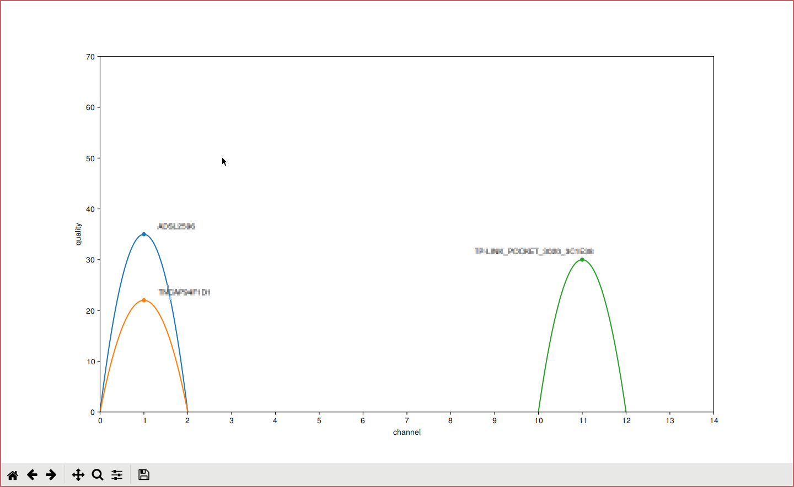

# Description

This is a wifi analyser.  It very basically mimics the *Wifi Analyser*
Android's app interface that shows what channel are used and how good the
signal is for each essid. Many improvements can be done (see TODO section),
though it's easily hackable.

There is small shell script - `scan.sh` - doing the scans.
It loops and runs `iwlist scan` and formats the output.
(8 lines)

`wifi_analyser.py` should parse the output of the script and dynamically plots
the results with `matplotlib`. (about 100 lines)

Usage section below shows how to use the tool.

# Requirements

Python requirements:
- `python3`
- `numpy`
- `matplotlib`
- `adjustText`

System requirements:
- linux friendly system
- `iwlist`
- `ip`

# Usage

1. clone or download

2. configure (python virtualenv and interface setup)
```sh
#!/bin/sh -e
python3 -m venv venv
./venv/bin/pip install --upgrade pip
./venv/bin/pip install numpy matplotlib adjustText
IWNAME= wifi interface name to use
sed -i "s/wlp2s0b1/$IWNAME/" scan.sh
```

3. analyze
```sh
sh scan.sh | python wifi_analyser.py
```

# TODO

- keep the previous scans by dimming the colors
- locate scans on a map (big one)
- smooth transitions
- overlapping channels fusion

Dreammap:
use the tool in real situtations: evaluate best wifi options in the scan area

# Preview


(screenshot token with the GTK3Cairo matplotlib backend)

# LICENCE

MIT Licence
